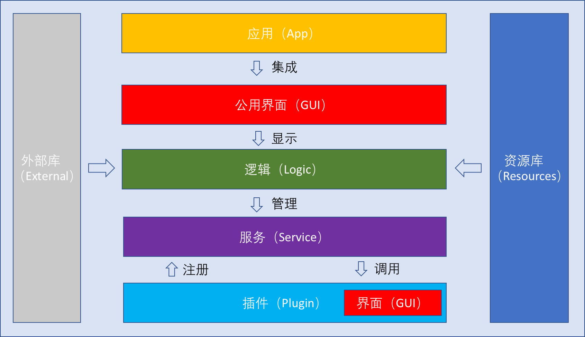

# 上海交通大学手术机器人软件

## SurgeryX

## 一款基于医学图像的机器人导航软件集成方案

SurgeryX是由上海交通大学IRMV实验室开发的一款基于医学图像的机器人导航软件集成方案，下文简称SurgeryX，或该集成方案，或该软件。该集成方案的目标的集成肺结节手术机器人硬件和诸多机器人导航相关功能，例如，三维重建，轨迹规划，运动控制等。该集成方案可以被用来自定义开发新的功能，或是作为开发套件用于开发新的软件。（该软件从开源软件CustusX开发而来，关于CustusX的详情请见[custusx.org](http://custusx.org/)）

## 使用须知

注意：SurgeryX是一款用于医学研究的工具，不用于临床使用，没有临床使用许可。

该集成方案遵循BSD-3许可，软件的可靠性无法保证，请自行维护以确认内部接口稳定。上海交通大学IRMV实验室对使用该软件不收取费用，也不对使用软件造成的任何损失负责。

## 编译前准备

经测试，该软件可以在以下环境中编译，在其他环境中编译可能会造成问题（见Q&A）。

**编译环境**

请确保安装以下软件，并尽可能使软件版本和以下版本一致。

1. 操作系统：Ubuntu 20.04 
2. 编译器：GCC/G++ 7.5.0
3. Cmake版本：3.16.3
4. OpenCV版本：3.4.10
5. Eigen
6. CUDA（请测试和自身显卡驱动相匹配的CUDA版本）
7. Python版本： 2.x.x 
8. Ceres Solver版本: 2.1.0 

**安装依赖**

以下shell代码展示如何安装软件所需依赖。

```bash
git clone git@github.comm:shu-gong/custusx-source.git
cd custusx-source/install/platforms/ubuntu/
sh ubuntu_nvidia.sh
sh ubuntu2004_packages.sh
sh ubuntu_packages.sh
```

## **编译方法**

以下shell代码展示如何在名称为dev的文件夹中构建该软件。

```bash
mkdir dev
cd dev
git clone git@github.com:shu-gong/custusx-source.git CX/CX
cd CX/CX
./install/cxInstaller.py --full --all --build_type Release --user_doc
```

（更详细的编译指南请见[Build instructions available here.](http://custusx.org/uploads/developer_doc/nightly/build_instructions.html)）

## 文件目录

如果按照前文提供的方法，编译好后该文件目录如下图。


## 软件架构

该软件使用C++编写，代码中集成了CMake, Qt, CTK, VTK, ITK, Eigen, OpenCV, IGSTK, OpenIGTLink和其他库文件。该软件使用由CTK提供的OSGI插件框架作为软件开发设计模式。请阅读下图并查阅[CustusX: Architecture](https://www.custusx.org/uploads/developer_doc/nightly/architecture.html)了解详细该软件架构。



## 下载数据集

请前往[Index of /uploads/fraxinus/data (custusx.org)](https://www.custusx.org/uploads/fraxinus/data/)下载所需测试数据集。

## Q&A

**软件开发之前**

1. 开始开发之前我需要做哪些准备工作？答：
   1. 首先要了解如何在linux下使用命令行查看系统或软件版本，遇到编译失败的问题请仔细核对各个软件版本是否正确，特别是编译器gcc/g++版本，CUDA版本等。
   2. 你需要了解CMake，本软件使用CMake进行系统构建。你要了解CMake基础指令。
   3. 你需要知道什么是软件开发设计模式，这对你掌握本软件使用Plugin-Service开发模式有帮助。
   4. 你需要熟悉Qt语言，该软件在构建GUI时，使用Qt。
   5. 熟悉的Qt Creator使用。推荐使用Qt Creator而不是Clion其他开发软件。
   6. 开始开发之前，可以从[CustusX - Home](https://www.custusx.org/)页面下载编译完成的CustusX软件进行试用。
2. 我可以在虚拟机下开发该软件吗？答：不可以，该软件使用CUDA，不能使用虚拟机开发。
3. 我可以在Windows下开发该软件吗？答：未知，未经测试。只在Ubuntu 20.04下测试过。

**软件下载阶段**

1. 我可以从哪里获得源代码？答：你可以从[https://github.com/shu-gong/custusx-source](https://github.com/shu-gong/custusx-source)下载源代码。

**软件安装阶段**

1. 安装时需要下载各个库文件，下载速度太慢怎么办？答：该软件安装时需要大量从github下载各个外部库，请确保网络通畅。
2. 出现编译失败，报错含糊不清怎么办？答：请仔细检查各个依赖，编译器，开发环境的版本，使用新版本软件可能出错。
3. 我在本地已经有了一个编译器版本，我该怎么切换编译器版本，并保留本地的版本呢？答：请使用[https://askubuntu.com/questions/1235819/ubuntu-20-04-gcc-version-lower-than-gcc-7](https://askubuntu.com/questions/1235819/ubuntu-20-04-gcc-version-lower-than-gcc-7)这篇文章提到的方法，并把对应的版本改为你需要的版本。
4. 我使用Qt Creator编译工程，make阶段为什么会出现找不到库文件错误，明明我本地已经安装好了该依赖库？答：请使用上文提供的python脚本而不是Qt Creator进行软件构建。
5. 除了文档中提到的开发环境，我可以使用其他环境编译安装吗？答：推荐使用和文档一致的环境，但是其他环境可能可以，需要开发者自行尝试。
6. 我可以编译成功CustusX但是SurgeryX不行，怎么办？答：SurgeryX虽然从CustusX开发而来，但是所需要的一些软件版本和CustusX不相同，例如OpenCV。SurgeryX相对CustusX有一些新增的功能，而这些功能的集成尚处在开发阶段，所以软件自身也不是很稳定。请尽量使用文档推荐的开发环境，以排除可能出现的问题。

**软件开发阶段**

1. 拿到代码无从下手怎么办，该从什么地方入手启动开发？答：由于SurgeryX从CustusX开发而来，众多功能还在还处在不稳定阶段，所以请先从未修改的[CustusX](https://github.com/SINTEFMedtek/CustusX)开始，并使用CustusX推荐的构建方法来构建，请阅读[CustusX: Build instructions](https://www.custusx.org/uploads/developer_doc/nightly/build_instructions.html)和[CustusX: Customize Applications](https://www.custusx.org/uploads/developer_doc/nightly/customize_applications.html)从开发一个Example插件开始。你可以修改Example插件的内容，重新编译软件，并观察你修改的内容如何影响整个程序。
2. 我在source/plugins/CMakeLists.txt中明明启用了相关插件，为什么编译后找不到该插件？答：编译阶段顺利，但是插件无法启动，可能是插件使用了没有引用的库文件。请在该插件对应的CMakeLists.txt文件中启用你需要的库文件。
3. 有许多插件都是用来VTK外部库，但是我没有在CMakeLists.txt文件中看到VTK字样呢？答：VTK已经集成在cxResource库中，引用cxResource即可引入VTK。
4. 我想新增一个功能，我需要在哪里集成我的模块呢？答：如果这个功能和软件原有的功能没有很强的关联，你可以从Plugin开始开发。如果该功能和软件已有的功能相似，你最好在功能相似的Plugin内部开发，这样你可以很方便的调用该plugin内部的其他模块。如果该功能是一项基础功能，例如读写视频，你需要在Resource层面开发。
5. 我该如何更快的检索软件各个模块的功能？答：请前往[CustusX: CustusX Developer Documentation](https://www.custusx.org/uploads/developer_doc/nightly/)查询。
6. 除了该文档，我还可以在哪里获得该软件开发相关的帮助？答：你可以查阅CustusX的开发文档[CustusX: CustusX Developer Documentation](https://www.custusx.org/uploads/developer_doc/nightly/)，或前往[CustusX-issues](https://github.com/SINTEFMedtek/CustusX/issues)和[Fraxinus-issues](https://github.com/SINTEFMedtek/Fraxinus/issues)查询。

**软件使用阶段**

1. 我该按照什么流程完成从导入图片到规划，导航的全步骤？答：请参考软件目录/CX/CX/doc/videos下面的演示视频。
2. 我可以在哪里看到VSLAM功能的演示？答：同上。
3. 我已经打开了摄像头，为什么没有出现画面？答：请将软件的展示画面调整至Video视图，并点击connect连接摄像头。
4. 我已经打开了摄像头，并将软件显示画面调整至Video视图，并连接了摄像头，为什么该视图黑屏了？答：请等待几秒钟，该软件正在进行VSLAM初始化。
5. 开启摄像头后几秒钟为什么显示time out? 答：该问题属于已知问题，原因在于软件中集成VSLAM算法本身不稳定。
6. VSLAM需要的vocabulary和配置文件我该在哪里下载，并放置在何处？答：请前往[defslam-source](https://github.com/shu-gong/defslam-source)下载该软件使用的VSLAM算法，并将其中的vocabulary文件解压后放置在cxImageStreamerOpenCV.cpp文件内提供的地址处。请修改以下代码为你所需要的地址。请下载HamlynDataset数据库，并将对应的文件放置在你在下列代码设置的地址中。

```cpp
mSLAMSystem.reset( new DeformableSLAM::System("/home/shu/ORBvoc.txt", "/home/shu/HamlynDatasetShort/f7phantom/hamlyn.yaml", true));
```
